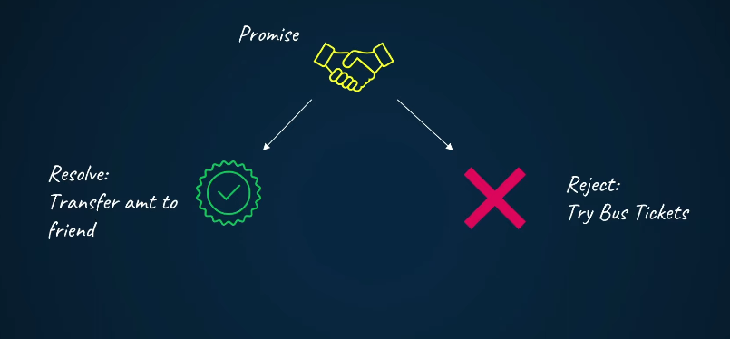

- If work done properly we say ```Resolve``` if any error occurs we say ```Reject```

- In JavaScript ```Promise``` is a ```Object``` we need to use  the new keyword to create 

- We need to pass the two parameter for  the object ( callBack())

``` javascript
const bookingPromise = new Promise((resolve, reject) => {

    const isBookingSuccessful = true;

    if (isBookingSuccessful) {
        resolve("Booking confirmed");
    } else {
        reject("Booking failed");
    }

});

bookingPromise
    .then(handleSuccess) // resolve
    .catch(handleFailure); // reject


function handleSuccess(message) {
    console.log(message);
    console.log("Thanks buddy, I will transfer the amount.");
}

function handleFailure(error) {
    console.log(error);
    console.log("Thanks for trying, I will book a bus.");
}


```
<br>

- adding (n) function inside  function is called callBackHell

| Feature          | try–catch | Promise / CompletableFuture |
| ---------------- | --------- | --------------------------- |
| Handles error    | ✅         | ✅                           |
| Runs async       | ❌         | ✅                           |
| Non-blocking     | ❌         | ✅                           |
| Chain operations | ❌         | ✅                           |
